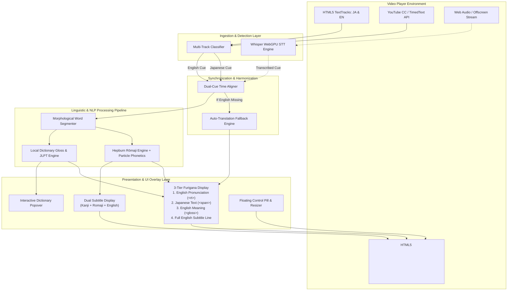

# Anime Rōmaji & Dual Subtitles (Local) - System Architecture

A comprehensive, local-first Chrome Extension architecture designed to supercharge Japanese language acquisition while watching anime, YouTube, and HTML5 video content. The extension concurrently ingests Japanese and English subtitles, synchronizes them in real time, and renders an interactive **3-Tier Furigana display** (Japanese Kanji/Kana + English Pronunciation + English Meaning).

---

## 1. System Overview & Data Flow



---

## 2. Ingestion Layer: Multi-Track Subtitle Detection

Videos on the web (anime streaming portals, YouTube, HTML5 video embeds) present subtitles in three distinct modalities. The architecture unifies all three into normalized cue streams:

### A. HTML5 Video `TextTrack` Architecture
- Every `<video>` element exposes a `textTracks` collection (`TextTrackList`).
- **The Problem in Previous Implementations**: Iterating over `video.textTracks` and breaking on the first active cue causes the second language track (English) to be completely ignored.
- **Architectural Solution**:
  1. **Track Classification**: All tracks are inspected and categorized:
     - **Japanese Track**: `track.language` matches `ja|jp|ja-jp` OR `track.label` matches `/japanese|日本語|ja/i` OR cue text contains Japanese scripts `[\u3040-\u309f\u30a0-\u30fa\u4e00-\u9faf]`.
     - **English Track**: `track.language` matches `en|en-us|en-gb` OR `track.label` matches `/english|en|eng/i` OR cue text contains Latin script without Japanese characters.
  2. **Non-Destructive Activation**: Set `track.mode = 'hidden'` for all relevant tracks so the browser engine fetches and parses cues without rendering browser-default black subtitle boxes.
  3. **Dual Query**: At any given playback timestamp (`video.currentTime`), query the active cue from both the Japanese track AND the English track simultaneously.

### B. YouTube Captions & TimedText Integration
- YouTube uses custom DOM nodes (`.ytp-caption-segment`) inside `#movie_player`.
- **Architectural Solution**:
  1. Detect currently active caption segments via `MutationObserver`.
  2. If the active segment is Japanese: use it directly as the Japanese text and fetch/pair with English subtitles.
  3. Query YouTube's `captionTracks` from the player response to fetch both `lang=ja` and `lang=en` (or `&tlang=en` auto-translated English) timed text tracks in parallel.

### C. Audio STT Fallback (Whisper WebGPU)
- For raw video streams lacking any pre-existing subtitle tracks, an offscreen document captures audio streams and runs local WebGPU Whisper inference (`transformers.js` with `whisper-tiny`), feeding timestamped text directly to the NLP pipeline.

---

## 3. Synchronization & Alignment Layer

Japanese and English subtitle cues do not always have identical start and end timestamps due to differing syllable counts and grammatical phrasing.

### Time-Window Harmonization Algorithm
```javascript
function getSynchronizedCues(jaTracks, enTracks, currentTime) {
  const jaCue = findActiveCue(jaTracks, currentTime);
  let enCue = findActiveCue(enTracks, currentTime);

  // If no exact English cue at currentTime, search within a tolerance window (±0.6s)
  if (jaCue && !enCue) {
    enCue = findClosestCue(enTracks, jaCue.startTime, jaCue.endTime, 0.6);
  }

  return { jaCue, enCue };
}
```

### In-Memory Cue Indexing & Sliding Lookahead Translation Engine
When a video only has Japanese subtitles (and no English track exists anywhere on the page or player):
- **Upfront Track Ingestion**: On video/track load, all Japanese cues (`track.cues`) are ingested into an in-memory sorted array (`loadedJapaneseCues`).
- **Sliding Lookahead Buffer (30–35s Window)**: Proactively identifies upcoming cues between `currentTime` and `currentTime + 35s`.
- **Rate-Controlled Pre-Fetch Queue**: Background worker fetches upcoming translations sequentially with a polite 120ms throttle, completely preventing HTTP 429 rate limits.
- **Zero-Latency Playback ($O(1)$)**: When the playback head arrives at the cue timestamp, the translation is already present in `translationCache`, rendering instantly with 0ms delay.
- **Instant Offline Fallback**: If an un-cached cue is encountered (e.g. following a sudden seek), the local dictionary token synthesizer (`synthesizeLocalTranslation`) renders the meaning within `<1ms`, upgrading smoothly once the web translation resolves.
- **Seek Reprioritization**: Scrubbing immediately clears distant queue items and refocuses the pre-fetch window on the new playback timestamp.

### Episode Transition & In-Memory State Reset Lifecycle
When watching anime series on streaming platforms (Crunchyroll, Netflix, YouTube, HiAnime):
- **SPA Navigation & Source Detection**: Single-Page Applications do not reload the page or extension context when users click "Next Episode". The extension continuously tracks `window.location.href`, `video.src` / `video.currentSrc`, and HTML5 media events (`loadstart`, `emptied`, `track_removed`, `yt-navigate-finish`).
- **Complete In-Memory Purge**:
  - Empties `loadedJapaneseCues` and `loadedEnglishCues` arrays to prevent previous episode cues from bleeding into the new episode during early fallback lookups ($t=0\text{s}$ to $t=2\text{s}$).
  - Resets `activeSubtitleCue`, `lastRenderedJapanese`, and `lastRenderedEnglish`, immediately hiding the overlay and preventing frozen subtitle artifacts on screen during loading/buffering screens.
  - Clears `preFetchQueue` and `pendingTranslations` sets.
- **Clean Ingestion & Deduplication**:
  - Automatically re-attaches `TextTrack` listeners and indexes new episode cues once `loadedmetadata` or `canplay` fires.
  - Cues in both Japanese and English streams are deduplicated by timestamp + text keys (`${startTime}_${text}`) to eliminate duplicate cues across repeated browser track-parsing events.

---

## 4. NLP & Linguistic Processing Engine

To enable effortless language acquisition, raw Japanese sentences are segmented, romanized, and glossed word-by-word.

### Step 1: Morphological Word Segmentation
Japanese lacks spaces between words. The segmenter uses a longest-match greedy algorithm backed by the sorted dictionary trie:
- Compounds like `死んでいる` (is dead) and `これから` (from now on) are treated as single cohesive semantic tokens rather than fragmented syllables.
- Particles like `は`, `が`, `を`, `に`, `で`, `の`, `も`, `と` are isolated as grammatical particles.

### Step 2: Hepburn Romanization & Particle Phonetics
- Standard Hiragana/Katakana to Hepburn Rōmaji conversion via Wanakana.
- Grammatical particle phonetic overrides:
  - Topic marker `は` -> pronounced **"wa"** (not "ha").
  - Direction particle `へ` -> pronounced **"e"** (not "he").
  - Object marker `を` -> pronounced **"o"** (not "wo").

### Step 3: Word Glossing & JLPT Mapping
- Each token is queried against the embedded dictionary (`dict_engine.js`).
- Returns:
  - `romaji`: English phonetic reading.
  - `shortMeaning`: Concise 1-3 word English definition for in-line display.
  - `jlpt`: Difficulty rating (`N5` through `N1`).
  - `pos`: Grammatical part-of-speech (Noun, Verb, Adjective, Particle, Copula).

---

## 5. Presentation & UI Overlay Layer: 3-Tier Furigana

The user interface supports three distinct reading modes, optimized for varying skill levels:

### A. 3-Tier Furigana Mode (`mode-ruby`)
Designed for simultaneous comprehension of Kanji, pronunciation, and meaning:
```
       [omae]           [wa]          [mou]        [shinde iru]
       お前              は            もう          死んでいる
       (you)          (topic)       (already)       (is dead)
------------------------------------------------------------------
                 "You are already dead."
```

#### DOM Hierarchy:
```html
<div class="anime-sub-container mode-ruby">
  <div class="anime-sub-kanji">
    <ruby class="anime-ruby-unit">
      <rt class="anime-ruby-rt">omae</rt>               <!-- Tier 1: English Pronunciation -->
      <span class="anime-kanji-token">お前</span>       <!-- Tier 2: Japanese Character -->
      <span class="anime-ruby-gloss">you</span>         <!-- Tier 3: English Meaning Gloss -->
    </ruby>
    ...
  </div>
  <!-- Tier 4: Full English Sentence Subtitle -->
  <div class="anime-sub-english">You are already dead.</div>
</div>
```

### B. Dual Subtitle Mode (`mode-dual`)
- **Line 1 (Japanese)**: Kanji & Kana tokens (`お前 は もう 死んでいる。`).
- **Line 2 (Pronunciation)**: Rōmaji karaoke line (`omae wa mou shinde iru.`) with synced word lighting.
- **Line 3 (English)**: Full English translation line (`"You are already dead."`).

### C. Hover-Only Mode (`mode-hover`)
- Minimalist Japanese-only subtitles.
- Hovering over any word reveals the interactive popover with English pronunciation, definition, and JLPT rating.

### D. Interactive Dictionary Popover
- Triggered on mouse hover over any Japanese or Rōmaji word token.
- Displays:
  - Badge: English Pronunciation (Rōmaji) in high-contrast gold.
  - Japanese Kanji + JLPT Badge (e.g. `N3`) + Part of Speech (`Pronoun`).
  - English Meanings list.

### E. Floating Control Pill & Video Controls
- Pinned to the video player header.
- Provides one-click toggles:
  - Subtitle Mode switcher (`Dual` / `Hover` / `Furigana`) - Hotkey: <kbd>M</kbd>
  - Subtitle Size adjuster (<kbd>[</kbd> / <kbd>]</kbd>) with 10% steps
  - English line toggle (<kbd>E</kbd>)
  - Replay cue (<kbd>R</kbd>)
  - Shadowing auto-pause (<kbd>P</kbd>)
  - Direct CC turn-on helper for YouTube

---

## 6. Directory Structure

```
Japanes Anime Extension/
├── Architecture.md                # System architecture documentation (this document)
├── extension/                     # Chrome Extension Package (Manifest V3)
│   ├── manifest.json              # Extension manifest, permissions, and script declarations
│   ├── popup/
│   │   ├── popup.html             # Popup settings panel
│   │   ├── popup.css              # Popup dark UI theme
│   │   └── popup.js               # Settings persistence (chrome.storage.local)
│   ├── content/
│   │   ├── content_script.js      # Video hook, dual-track sync, Furigana & karaoke engine
│   │   └── overlay.css            # 3-tier Furigana, karaoke glow, and popover styling
│   ├── lib/
│   │   ├── wanakana.min.js        # Kana-to-Romaji conversion engine
│   │   └── dict_engine.js         # Local dictionary (Kanji, Romaji, Meanings, JLPT)
│   ├── models/                    # Bundled local ONNX Whisper models (for offline audio STT)
│   └── icons/                     # Extension icons (16, 48, 128)
├── test_bench/                    # Interactive Video Test Bench
│   ├── video_test.html            # Video player with dual Japanese + English .vtt tracks
│   ├── sample_video.mp4           # Video sample file
│   ├── sample_1.vtt               # Reference Japanese subtitle file
│   ├── sample_1_en.vtt            # Reference English subtitle file
│   ├── index.html                 # Audio test bench
│   ├── style.css                  # Test bench styling
│   └── test_player.js             # Test runner logic
└── tests/                         # Node automated test suite
    ├── test_dictionary.js         # Dictionary & de-inflection unit tests
    ├── test_dual_subtitles.js     # Dual track & 3-tier Furigana tests
    ├── test_lookahead_cache.js    # Pre-loading & lookahead cache tests
    ├── test_pause_behavior.js     # Pause, freeze & simulated karaoke tests
    ├── test_episode_reset.js      # Episode transition & state reset tests
    └── run_transcription_test.js  # Whisper STT accuracy & latency benchmarks
```
---

## 7. Verification & Quality Matrix

| Feature / Scenario | Expected Behavior | Verification Method |
| :--- | :--- | :--- |
| **Dual Track Video (JA + EN)** | Both Japanese & English subtitles load concurrently at current timestamp. | Test on `video_test.html` with dual tracks. |
| **Japanese-Only Video** | Japanese loads; English line auto-translates via fallback engine. | Disable English track in video player. |
| **Episode Transition Reset** | Memory cues cleared; old subtitles never bleed into next episode. | `npm test` (`test_episode_reset.js`). |
| **Furigana Mode** | Renders Pronunciation (top) + Kanji (middle) + English Meaning (bottom) + Full English line. | Press <kbd>M</kbd> to switch to Furigana mode. |
| **Word Hover Popover** | Instant popover with English pronunciation, JLPT tag, and definition. | Hover over `お前`, `死んでいる`, `天気`. |
| **Font Resizing** | Subtitle container and text scale proportionally between 80% and 220%. | Press <kbd>[</kbd> and <kbd>]</kbd>. |
| **Hotkeys** | <kbd>M</kbd> switches modes, <kbd>E</kbd> toggles English, <kbd>R</kbd> replays line. | Keypress checks during video playback. |
